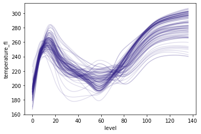

<div align="center">
  <br><br>

  [](https://pypi.org/project/synthia) [](https://github.com/dmey/synthia/actions)

  [Overview](#overview) | [Documentation](#documentation) | [How to cite](#how-to-cite) | [Contributing](#contributing) | [Development notes](#development-notes) | [Copyright and license](#copyright-and-license) | [Acknowledgements](#acknowledgements)
</div>

## Overview

Synthetic data need to preserve the statistical properties of real data in terms of their individual behavior and (inter-)dependences ([Meyer et al. 2021](https://doi.org/10.5194/gmd-2020-427)). [Copula](https://dmey.github.io/synthia/copula.html) and [functional Principle Component Analysis (fPCA)](https://dmey.github.io/synthia/fpca.html) are statistical models that allow these properties to be simulated ([Joe 2014](https://doi.org/10.1201/b17116)). As such, copula generated data have shown potential to improve the generalization of machine learning (ML) emulators ([Meyer et al. 2021](https://doi.org/10.5194/gmd-2020-427)) or anonymize real-data datasets ([Patki et al. 2016](https://doi.org/10.1109/DSAA.2016.49)).

Synthia is an open source Python package to model univariate and multivariate data, parameterize data using empirical and parametric methods, and manipulate marginal distributions. It is designed to enable scientists and practitioners to handle labelled multivariate data typical of computational sciences. For example, given some vertical profiles of atmospheric temperature, we can use Synthia to generate new but statistically similar profiles in just three lines of code (Table 1).

Synthia supports three methods of multivariate data generation through: (i) fPCA, (ii) parametric (Gaussian) copula, and (iii) vine copula models for continuous (all), discrete (vine), and categorical (vine) variables. It has a simple and succinct API to natively handle [xarray](https://xarray.pydata.org)'s labelled arrays and datasets. It uses a pure Python implementation for fPCA and Gaussian copula, and relies on the fast and well tested C++ library [vinecopulib](https://github.com/vinecopulib/vinecopulib) through [pyvinecopulib](https://github.com/vinecopulib/pyvinecopulib)'s bindings for fast and efficient computation of vines. For more information, please see the website at https://dmey.github.io/synthia.


**Table 1**. *Example application of Gaussian and fPCA classes in Synthia. These are used to generate random profiles of atmospheric temperature similar to those included in the source data. The xarray dataset structure is maintained and returned by Synthia.*

| Source                                       | Synthetic with Gaussian Copula                           | Synthetic with fPCA                              |
| -------------------------------------------- | -------------------------------------------------------- | ------------------------------------------------ |
| `ds = syn.util.load_dataset()`               | `g = syn.CopulaDataGenerator()`                          | `g = syn.fPCADataGenerator()`                    |
|                                              | `g.fit(ds, syn.GaussianCopula())`                        | `g.fit(ds)`                                      |
|                                              | `g.generate(n_samples=500)`                              | `g.generate(n_samples=500)`                      |
|                                              |                                                          |                                                  |
|  |  |  |


## Documentation

For installation instructions, getting started guides and tutorials, background information, and API reference summaries, please see the [website](https://dmey.github.io/synthia).


## How to cite

If you are using Synthia, please cite the following two papers using their respective Digital Object Identifiers (DOIs). Citations may be generated automatically using Crosscite's [DOI Citation Formatter](https://citation.crosscite.org/) or from the BibTeX entries below.

| Synthia Software                   | Software Application                                              |
| ---------------------------------- | ----------------------------------------------------------------- |
| DOI: 10.21105/joss.02863           | DOI: [10.5194/gmd-2020-427](https://doi.org/10.5194/gmd-2020-427) |

```bibtex
@article{Meyer_and_Nagler_2021,
  title   = {Synthia: multidimensional synthetic data generation in Python},
  author  = {David Meyer and Thomas Nagler},
  year    = {2021},
  doi     = {10.21105/joss.02863},
  journal = {Journal of Open Source Software},
  note    = {Under review}
}

@article{Meyer_Nagler_and_Hogan_2021,
  doi = {10.5194/gmd-14-5205-2021},
  url = {https://doi.org/10.5194/gmd-14-5205-2021},
  year = {2021},
  month = aug,
  publisher = {Copernicus {GmbH}},
  volume = {14},
  number = {8},
  pages = {5205--5215},
  author = {David Meyer and Thomas Nagler and Robin J. Hogan},
  title = {Copula-based synthetic data augmentation for machine-learning emulators},
  journal = {Geoscientific Model Development}
}
```

If needed, you may also cite the specific software version with [its corresponding Zendo DOI](https://doi.org/10.5281/zenodo.4701278). 

## Contributing

If you are looking to contribute, please read our [Contributors' guide](CONTRIBUTING.md) for details.


## Development notes

If you would like to know more about specific development guidelines, testing and deployment, please refer to our [development notes](DEVELOP.md).


## Copyright and license

Copyright 2020 D. Meyer and T. Nagler. Licensed under [MIT](LICENSE.txt).


## Acknowledgements

Special thanks to [@letmaik](https://github.com/letmaik) for his suggestions and contributions to the project.
