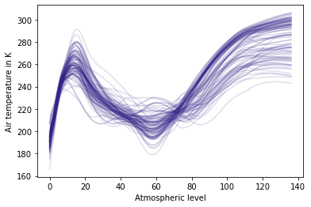

    

   

  [Overview](#overview) | [Documentation](#documentation) | [How to cite](#how-to-cite) | [Contributing](#contributing) | [Development notes](#development-notes) | [Copyright and license](#copyright-and-license) | [Acknowledgements](#acknowledgements)

## Overview

Synthia is a tool for generating multidimensional data in Python. It has a simple and succinct API to natively handle [xarray](https://xarray.pydata.org)'s labelled arrays and datasets. It supports different methods of data generation such as [functional Principle Component Analysis (fPCA)](https://dmey.github.io/synthia/fpca.html), and parametric (Gaussian) and vine [copula models](https://dmey.github.io/synthia/copula.html) for continuous (all), discrete (vine), and categorical (vine) variables. For example, given some vertical profiles of atmospheric temperature, we can use Synthia to generate new but statistically similar profiles in just three lines of code (Table 1). For more information about the latest version of Synthia, please see the [website](https://dmey.github.io/synthia).

**Table 1**. *Example application of Gaussian and fPCA classes in Synthia. These are used to generate random profiles of atmospheric temperature similar to those included in the source data. The xarray dataset structure is maintained and returned by Synthia.*

| Source                                       | Synthetic with Gaussian Copula                           | Synthetic with fPCA                              |
| -------------------------------------------- | -------------------------------------------------------- | ------------------------------------------------ |
| `ds = syn.util.load_dataset()`               | `g = syn.CopulaDataGenerator()`                          | `g = syn.fPCADataGenerator()`                    |
|                                              | `g.fit(ds, syn.GaussianCopula())`                        | `g.fit(ds)`                                      |
|                                              | `g.generate(n_samples=500)`                              | `g.generate(n_samples=500)`                      |
|                                              |                                                          |                                                  |
|  |  |  |

## Documentation

For installation instructions, getting started guides and tutorials, background information, and API reference summaries, please see the [website](https://dmey.github.io/synthia).

## How to cite

Please cite the software summary paper and software version using the following Digital Object Identifiers (DOIs) to [generate citations in your preferred style](https://citation.crosscite.org/):

| Software summary paper | Software version* |
| ---------------------- | ----------------- |
| *In Preparation*       | *In Preparation*  |

*please make sure to cite the same version you are using with the correct DOI. For a list of all available versions see the list of available versions (In Preparation).

## Contributing

If you are looking to contribute, please read our [Contributors' guide](CONTRIBUTING.md) for details.

## Development notes

If you would like to know more about specific development guidelines, testing and deployment, please refer to our [development notes](DEVELOP.md).

## Copyright and license

Copyright 2020 D. Meyer and T. Nagler. Licensed under [MIT](LICENSE.txt).

## Acknowledgements

Special thanks to [@letmaik](https://github.com/letmaik) for his suggestions and contributions to the project.
