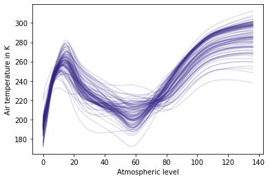

    

  [Overview](#overview) | [How to cite](#how-to-cite) | [Contributing](#contributing) | [Development notes](#development-notes) | [Copyright and license](#copyright-and-license) | [Acknowledgements](#acknowledgements)

## Overview

Synthia is a tool for generating (continuous) multi-dimensional data in Python. It has a simple and succinct API to natively handle multidimensional data using [xarray](https://xarray.pydata.org)'s labeled arrays and datasets. For example, given some vertical profiles of atmospheric temperature, we can use Synthia to generate new but statistically similar profiles.

**Example application of Gaussian and fPCA classes in Synthia used to generate random profiles of atmospheric temperature similar to those included in the SAF dataset (REF). The xarray dataset structure is maintained and returned by Synthia.**

| Source                                   | Synthetic with Gaussian Copula                     | Synthetic with fPCA                            |
| ---------------------------------------- | -------------------------------------------------- | ---------------------------------------------- |
| `ds = syn.util.load_dataset()`           | `g = syn.CopulaDataGenerator()`                    | `g = syn.fPCADataGenerator()`                  |
|                                          | `g.fit(ds, syn.GaussianCopula())`                  | `g.fit(ds)`                                    |
|                                          | `g.generate(n_samples=500)`                        | `g.generate(n_samples=500)`                    |
|                                          |                                                    |                                                |
|  |  |  |

For installation instructions, tutorials and general information, see https://dmey.github.io/synthia.

## How to cite

[TODO]

## Contributing

See [CONTRIBUTING.md](CONTRIBUTING.md).

## Development notes

See [DEVELOP.md](DEVELOP.md).

## Copyright and license

Copyright 2020 D. Meyer and T. Nagler. Licensed under [MIT](LICENSE.txt).

## Acknowledgements

Special thanks to [@letmaik](https://github.com/letmaik) for his suggestions and contributions to the project.
